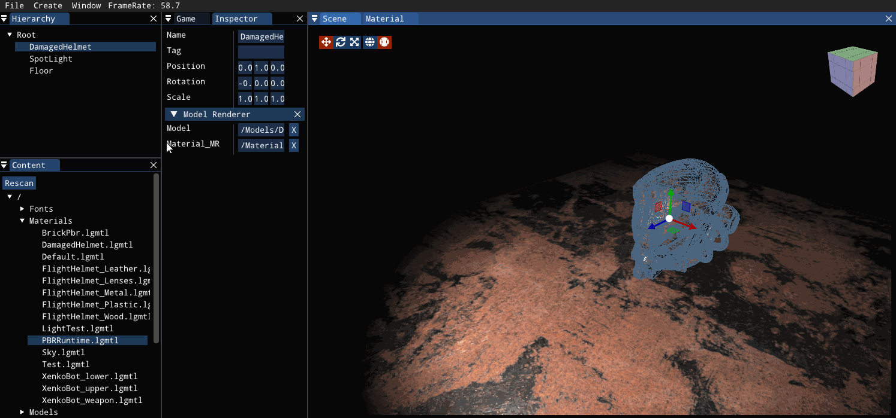

# 一些个人作品

## 基于OpenGL的渲染器

源代码见[这里](https://github.com/carlcc/Loong)，业余时间做的玩具项目。

## 翻译工具

暂未开源

客户端使用`flutter/dart` + `C++`实现。

服务端使用`nodejs` + `typescript` + `C++` + `python`（因为部分功能最早用python写的，考虑重写）实现。

功能演示如下：

<video src="https://github.com/carlcc/someworks/assets/12776190/08c01a19-d820-40fa-bfa2-b93fab3bdbca"></video>

视频翻译功能的输入、输出视频见`/videos/translate/douyin.mp4`和`/videos/translate/douyin.translated.mp4`。

## 基于Godot4游戏引擎的VR视频播放器

其实是个人`将游戏引擎作为跨平台GUI框架`的一个实验性项目：

- 使用`C++`向`Godot`引擎加入原本不支持的功能（即全能的视频播放、硬件解码等）
- 将基于`ffmpeg`的视频解码框架经过包装，暴露给`GDScript`
- 创建一个“游戏项目”，搭建游戏场景作为播放器。

说明：
- 源代码见[这里](https://github.com/carlcc/GodotVRVideoPlayer)。
- 项目依赖`ffmpeg`，但是并没有将`ffmpeg`打包进项目，你需要自己下载或者编译。
- 测试了`Windows`和`Android`平台，功能正常，其他平台未测试。
- 仅实现了普通视频和球坐标映射全景视频的播放。立方体映射的全景视频播放未支持。
- 随手做的玩的项目，恕无相关文档和手把手教程，编译方法请参考`Godot`官方文档，以及阅读我在项目中新增的编译脚本。实在有困难可以发Issue。

功能演示(Android端)：

<video src="https://github.com/carlcc/someworks/assets/12776190/2069b1e0-a69e-483a-b81f-4fe5075f0de2"></video>

## Android原生VR视频播放器

基于Godot的VR播放器性能不佳，在手机端播放高清、高帧率视频会卡顿，原因也很简单，由于游戏引擎和FFMPEG分别都做了一些抽象，播放视频少不了一些拷贝和视频帧格式转换，造成了不小的不必要开销。

因而用安卓原生API重新做了一个简单的播放器，尽量减少不必要的拷贝。使用MediaCodec解码视频，External OES 纹理接收帧，然后使用OpenGL draw call拷贝帧到2D纹理中，最后生成mipmap，渲染。

功能演示：

<video src="https://github.com/carlcc/someworks/assets/12776190/84fe48f0-1031-4aba-b0da-0e616b1b5db5"></video>

## 流媒体服务器测试客户端

这是我为了方便开发流媒体服务器而开发的测试工具，使用C++ + OpenGL + ImGui绘制界面。

主程序+插件架构，主程序提供一些API和几个基本功能，其余所有功能都由插件实现。

以下是几张运行截图：

<video src="https://github.com/carlcc/someworks/assets/12776190/752a4042-2236-4c3b-9241-63bf89834be0"></video>